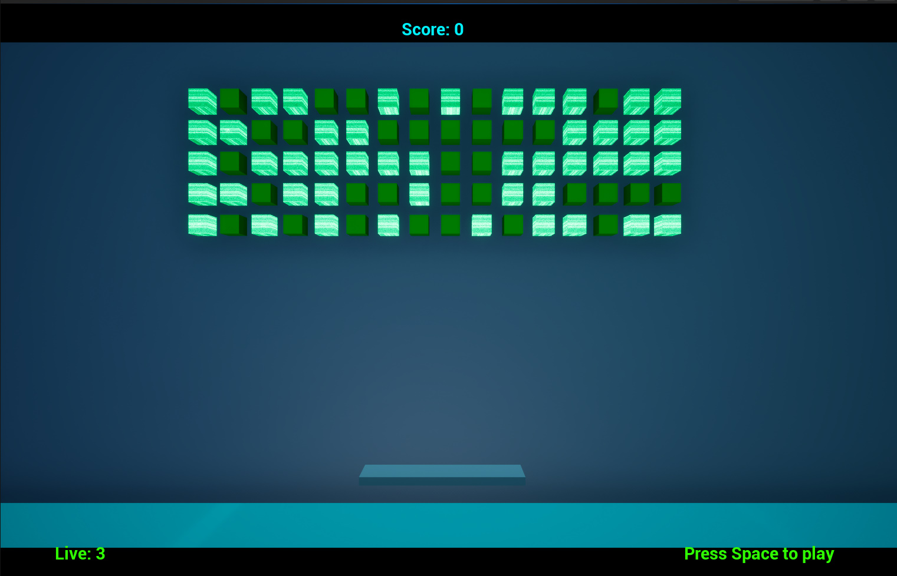
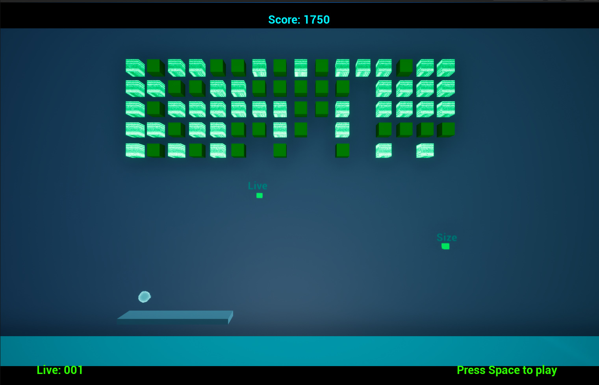

# Arcanoid Clone | Unreal Engine 5

A classic arcade-style gameplay prototype created in Unreal Engine 5.

## Overview

Arcanoid Clone is a gameplay prototype inspired by the classic brick breaker genre. The project focuses on implementing arcade gameplay systems, collision handling, score progression and bonus mechanics using Unreal Engine 5 Blueprints.

## Features

- Player-controlled paddle movement
- Ball physics and collision handling
- Destructible brick system
- Score system
- Lives system
- Gameplay bonuses and modifiers
- Game start and restart logic
- HUD and win screen UI

## Technologies

- Unreal Engine 5
- Blueprint Visual Scripting
- UMG UI
- Collision System
- Gameplay Framework

## Main Blueprints

- BP_Ball
- BP_MyPawn
- BP_GameMode
- BP_Cubes_Generator
- BP_Bonus

## Screenshots

## Links

- ArtStation: https://www.artstation.com/artwork/Gvb1PW

## My Responsibilities

- Gameplay Programming
- UI Implementation
- Blueprint Logic
- Game State Management
- Visual Setup
